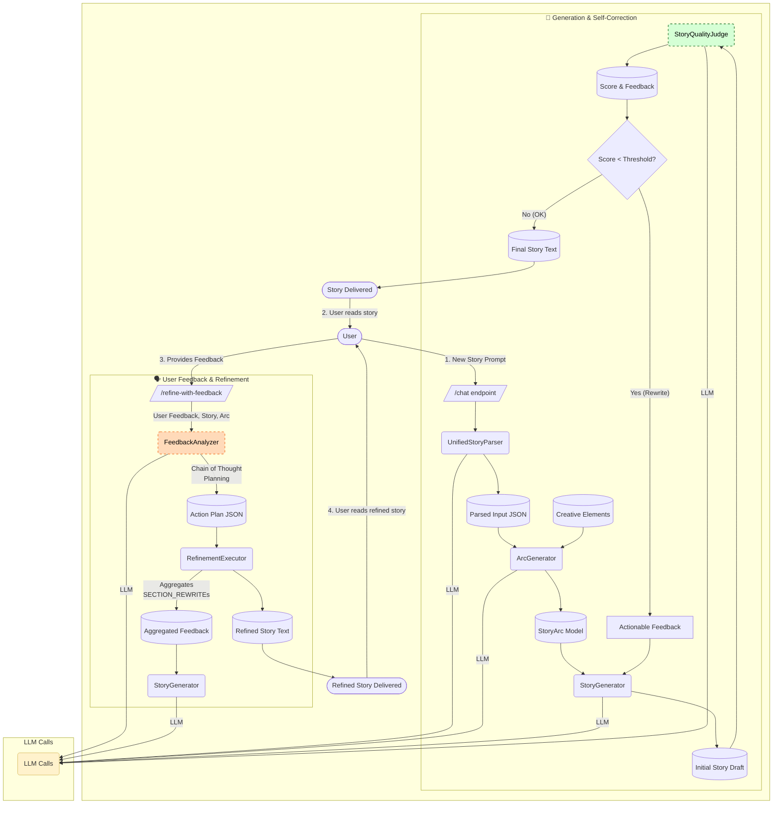

# 🌟 Storyteller AI 🌟

Storyteller AI is an advanced, conversational storytelling application that leverages Large Language Models (LLMs) to dynamically generate and refine children's stories. It goes beyond simple generation by incorporating two sophisticated, AI-driven feedback loops: a **self-correction loop** for quality assurance and a **user feedback loop** for handling revisions.

## Core Features

-   **Dynamic Story Arc Generation**: Creates a unique five-stage story arc from a simple user prompt by combining it with random creative elements (catalysts, themes, moods).
-   **Iterative Story Writing**: Generates the story chapter-by-chapter, feeding context from previous chapters to the LLM to ensure narrative coherence.
-   **Automated Quality Assurance**: A "Story Quality Judge" AI evaluates the first draft against a rubric and provides a score. If the score is too low, the system autonomously rewrites the weak parts.
-   **Intelligent User Feedback Processing**: When a user requests a change, a "Feedback Analyzer" AI uses Chain of Thought reasoning to create a structured, multi-step action plan, which is then reliably executed.
-   **End-to-End Testing**: Includes a `test_flow.sh` script to run a full generation and refinement cycle from the command line.

## Architecture Overview

The application is built around two primary workflows: **Generation & Self-Correction** and **User Feedback & Refinement**. These are orchestrated by a FastAPI backend.



## How to Run

### Prerequisites
- Python 3.8+
- An OpenAI API key

### 1. Backend Setup

First, navigate to the backend directory and set up the Python environment.

```bash
cd backend
```

Create and activate a virtual environment:
```bash
python -m venv storyteller-env
source storyteller-env/bin/activate
# On Windows, use: storyteller-env\Scripts\activate
```

Install the required dependencies:
```bash
pip install -r requirements.txt
```

### 2. Configuration

Create a `config.py` file inside the `backend/` directory and add your OpenAI API key:

```python
# backend/config.py
OPENAI_API_KEY = "sk-..." 
# Optional: You can also tune the model and temperature here
# OPENAI_MODEL = "gpt-4"
# OPENAI_TEMPERATURE = 0.7
```

### 3. Running the Server

Once configured, you can start the FastAPI server:

```bash
# Make sure you are in the backend/ directory and your venv is active
python main.py
```
The API will be available at `http://localhost:8000`.

### 4. Frontend Setup

The frontend is a simple HTML/CSS/JS application.

```bash
cd frontend
```

The easiest way to run it is with Python's built-in web server:
```bash
# Make sure you are in the frontend/ directory
python -m http.server 3000
```
You can now access the application at `http://localhost:3000` in your browser.

### 5. Running the End-to-End Test

From the root directory of the project, you can run a full test cycle using the provided shell script. This script will generate a story and then refine it based on pre-written feedback.

```bash
# Make sure the backend server is running first!
./test_flow.sh
```

## Key Innovations

This project demonstrates several advanced techniques for controlling and working with LLMs:

-   **Planner-then-Executor Pattern**: For handling complex user feedback, the AI is first used as a "planner" to decompose the request into a structured JSON action plan. A deterministic Python executor then reliably carries out that plan.
-   **Chain of Thought (CoT) Reasoning**: The feedback-planning prompt forces the AI to "think step-by-step" and write out its reasoning *before* creating the action plan. This dramatically improves its accuracy on multi-part requests and provides excellent observability.
-   **AI as a Quality Judge**: A separate AI agent with a different prompt and a low temperature is used to evaluate the creative output of another AI, enabling automated quality control and self-correction loops.
-   **Surgical Rewrites**: By using structured feedback and context, the system can perform "surgical" rewrites, modifying only the unsatisfactory parts of a story while preserving the parts that are already good.

## 🎯 Features

- **Child-Friendly Interface**: Colorful, intuitive design with large buttons and emojis
- **Interactive Storytelling**: AI-powered story generation based on user preferences
- **Quick Story Categories**: Adventure, Animals, Magic, and Space themes
- **Text-to-Speech**: Optional read-aloud functionality for non-readers
- **Responsive Design**: Works on desktop, tablet, and mobile devices
- **Safe & Simple**: Clean, age-appropriate content and interactions

## 🚀 Quick Start

### Backend Setup (Python)

1. **Navigate to the backend directory:**
   ```bash
   cd backend
   ```

2. **Create a virtual environment (recommended):**
   ```bash
   python -m venv storyteller-env
   source storyteller-env/bin/activate  # On Windows: storyteller-env\Scripts\activate
   ```

3. **Install dependencies:**
   ```bash
   pip install -r requirements.txt
   ```

4. **Start the backend server:**
   ```bash
   python main.py
   ```
   
   The API will be running at `http://localhost:8000`
   
   You can view the API documentation at `http://localhost:8000/docs`

### Frontend Setup

1. **Navigate to the frontend directory:**
   ```bash
   cd frontend
   ```

2. **Open the application:**
   - Simply open `index.html` in your web browser, or
   - Use a local server (recommended):
     ```bash
     # Using Python's built-in server
     python -m http.server 3000
     ```
     Then open `http://localhost:3000` in your browser

## 🏗️ Project Structure

```
Storyteller-agent/
├── frontend/
│   ├── index.html          # Main HTML page
│   ├── style.css           # Styles and animations
│   └── script.js           # Frontend functionality
├── backend/
│   ├── main.py             # FastAPI backend
│   └── requirements.txt    # Python dependencies
└── README.md               # This file
```

## 🎮 How to Use

1. **Start the Backend**: Run the Python server first
2. **Open the Frontend**: Load the HTML page in your browser
3. **Begin Storytelling**: 
   - Type what kind of story you want, or
   - Click one of the quick action buttons (Adventure, Animals, Magic, Space)
4. **Interactive Conversation**: The storyteller will create a story and ask you questions
5. **Read Aloud**: Click the "Read Aloud" button to have stories spoken
6. **New Story**: Click "New Story" to start fresh

## 🛠️ Technical Details

### Backend (Python + FastAPI)
- **FastAPI**: Modern, fast web framework
- **CORS enabled**: Allows frontend-backend communication
- **Simple story generation**: Keyword-based story selection
- **Template system**: Predefined story starters with random elements
- **RESTful API**: Clean `/chat` endpoint for communication

### Frontend (HTML + CSS + JavaScript)
- **Vanilla JavaScript**: No frameworks, lightweight and fast
- **CSS Grid/Flexbox**: Responsive layout
- **Web Speech API**: Text-to-speech functionality
- **Modern CSS**: Gradients, animations, and hover effects
- **Accessibility**: Keyboard navigation and focus management

## 🎨 Design Features

- **Color Palette**: Bright, engaging colors suitable for children
- **Typography**: Comic Neue font for readability and fun
- **Animations**: Subtle hover effects and loading animations
- **Emojis**: Visual elements to enhance engagement
- **Background**: Animated stars and clouds for atmosphere

## 🔧 Customization Ideas

- **Add more story templates** in `backend/main.py`
- **Integrate with AI services** (OpenAI, Anthropic) for advanced storytelling
- **Add user accounts** and story saving functionality
- **Include illustrations** or image generation
- **Add sound effects** and background music
- **Create story categories** for different age groups
- **Implement parental controls** and content filtering

## 🚦 API Endpoints

- `GET /` - Welcome message
- `POST /chat` - Main storytelling endpoint
- `GET /health` - Health check
- `GET /docs` - API documentation (Swagger UI)

## 📱 Browser Compatibility

- ✅ Chrome/Chromium (recommended)
- ✅ Firefox
- ✅ Safari
- ✅ Edge
- ⚠️ Internet Explorer (limited support)

## 🎯 Future Enhancements

- Integration with advanced AI models for more sophisticated storytelling
- User accounts and story history
- Illustration generation for stories
- Multi-language support
- Voice input recognition
- Story sharing features
- Progress tracking and achievements
- Educational content integration

## 🤝 Contributing

This is a POC project. Feel free to fork and enhance it! Some areas for improvement:
- Better error handling
- Session management
- Story persistence
- More interactive elements
- Better AI integration

## 📄 License

This project is open source and available under the MIT License.

---

**Happy Storytelling! 🧙‍♂️✨**

*"Every child deserves a magical story, and every story deserves to be told with wonder."* 

const API_BASE_URL = 'http://localhost:8000'; // Backend API URL 

async function sendMessage() {
    const userInput = document.getElementById('userInput');
    const message = userInput.value.trim();
    
    if (!message) return;
    
    // Clear input and add user message to chat
    userInput.value = '';
    addMessage(message, 'user');
    showLoading();
    
    try {
        // Send POST request to backend
        const response = await fetch(`${API_BASE_URL}/chat`, {
            method: 'POST',
            headers: {
                'Content-Type': 'application/json',
            },
            body: JSON.stringify({ message: message })
        });
        
        if (response.ok) {
            const data = await response.json();
            hideLoading();
            addMessage(data.response, 'storyteller');
            
            // Auto-read if enabled
            if (isReadingAloud) {
                speakText(data.response);
            }
        } else {
            throw new Error('Network response was not ok');
        }
    } catch (error) {
        console.error('Error:', error);
        hideLoading();
        addMessage("Oops! I'm having trouble connecting to my magical powers right now. Can you try again in a moment? ✨", 'storyteller');
    }
} 

function quickStory(type) {
    const storyPrompts = {
        adventure: "Tell me an exciting adventure story!",
        animals: "I want to hear a story about animals!",
        magic: "Can you tell me a magical story?",
        space: "Tell me a story about space and rockets!"
    };
    
    const userInput = document.getElementById('userInput');
    userInput.value = storyPrompts[type];
    sendMessage(); // Calls the same function
} 